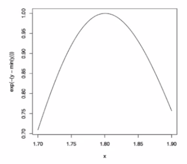
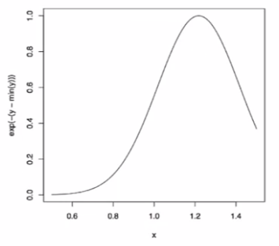

# Week 2

**Control structures**

Control structures in R allow you to control the flow of the execution of the program, depending on run-time conditions.

- `if`, `else`: testing a condition;
- `for`: execute a loop a fixed number of times;
- `while`: execute a loop while a condition is true;
- `repeat`: execute an infinite loop;
- `break`: break the execution of a loop;
- `next`: skip an iteration of a loop;
- `return`: exit a function.

Most control structures are not used in interactive sessions, but rather when writing functions or longer expressions.

**Control structures: `if`**

~~~R
if(<condition>) {
    ## do smth
} else {
    ## do smth
}
if(<condition1>) {
    ## do smth
} else if(<condition2>) {
    ## do smth different
} else {
    ## do smth else
}
~~~

This is a valid if/else structure.

~~~R
if(x > 3){
    y <- 10
} else {
    y <- 0
}
~~~

So is this one.

~~~~R
y <- if(x > 3) {
    10
} else {
    0
}
~~~~

**Control structures: `for`**

`for` loops take an iterator variable and assign it successive values from a sequence or vector.

~~~R
for(i in 1:10){
    print(i)
}
~~~

These loops have the same behavior.

~~~R
x <- c("a", "b", "c", "d")

for(i in 1:length(x)){
    print(x[i])
}

for(i in seq_along(x)){
    print(x[i])
}

for(letter in x){
    print(letter)
}

for(i in 1:length(x)) print(x[i])
~~~

**Nested `for` loops**

~~~R
x <- matrix(1:6, 2, 3)

for(i in seq_len(nrow(x))){
    for(j in seq_len(ncol(x))){
        print(x[i,j])
    }
}
~~~

**Control structures: `while`**

While loops begin by testing a condition. If it is true, then they execute the loop body. Once the loop body is executed, the condition is tested again, and so forth.

~~~R
count <- 0
while(count < 10){
    print(count)
    count <- count + 1
}
~~~

Sometimes there will be more than one condition in the test.

~~~R
z <- 5

while(z >= 3 && z <= 10) {
    print(z)
    coin <- rbinom(1, 1, 0.5)

    if(coin == 1) {
        z <- z + 1
    } else {
        z <- z - 1
    }
}
~~~

**Control structures: `repeat`**

Repeat initiates an infinite loop; these are not commonly used in statistical applications but they do have their issues. 

The only way to exit a `repeat` loop is to call `break`.

~~~R
x0 <- 1
tol <- 1e-8

repeat {
    x1 <- computeEstimate()

    if(abs(x1 - x0) < tol) {
        break
    } else {
        x0 <- x1
    }
}
~~~

This loop is a bit dangerous because there is no guarantee it will stop. Better to set a hard limit on the number of iterations (e. g., using a for loop) and then report whether convergence was achieved or not.

**`next`, `return`**

`next` is used to skip an iteration of a loop.

~~~R
for(i in 1:100) {
    if(i <= 20) next
    # do sth here
}
~~~

`return` signals that a function should exit and return a given value.

**Functions**

Functions are created using the `function()` directive and are stored as R objects, just like anything else. In particular, they are R objects of class "function".

~~~R
f <- function(<args>) {
    ## do sth
}
~~~

Functions in R are "first class objects", which means that they can be treated much like any other R object. Importantly,

- Functions can be passed as arguments to other functions.
- Functions can be nested, so that you can define a function inside of another function. Th return value of a function is the last expression in the function body to be evaluated.

Functions haves *named arguments* which potentially have *default values*.

- The *formal arguments* are the arguments included in the function definition.
- The `formals` function returns a list of all the formal arguments of a function.
- Not every function call in R makes use of all the formal arguments.
- Function arguments can be missing or might have default values.

###### Argument matching

R functions arguments can be matched positionally or by name. So the following calls to`sd` are all equivalent.

~~~R
mydata <- rnorm(100)
sd(mydata)
sd(x = mydata)
sd(x = mydata, na.rm = FALSE)
sd(na.rm = FALSE, x = mydata)
sd(na.rm = FALSE, mydata)
~~~

Even though it is legal, I do not recommend messing around with the order of the arguments too much, since it can lead to some confusion.

You can mix positional matching with matching by name. When an argument is matched by name, it is "taken out" of the argument list and the remaining unnamed arguments are matched in the order that they are listed in the function definition.

~~~R
args(lm)
# function(formula, data, subset, weights, na.action,
#          method = "qr", model = TRUE, x = FALSE,
#          y = FALSE, qr = TRUE, singular.ok = TRUE,
#          contrasts = NULL, offset, ...)
~~~

The following two calls are equivalent.

~~~R
lm(data = mydata, y ~ x, model = FALSE, 1:100)
lm(y ~ x, mydata, 1:100, model = FALSE)
~~~

Function arguments can also be partially matched, which is useful for interactive work. The order of operations when given an argument is:

1. Check for the exact match for a named argument;
2. Check for a partial match;
3. Check for a positional match.

In addition to not specifying a default value, you can also set an argument value to `NULL`.

~~~R
f <- function(a, b = 1, c = 2, d = NULL) {
    ...
}
~~~

###### Lazy evaluation

Arguments to functions are evaluated lazily, so they are evaluated only as needed.

~~~R
f <- function(a, b) {
    a^2
}

f(2)
# [1] 4
~~~

This function never actually uses the argument `b`, so calling `f(2)` will not produce an error because the $2$ gets positionally matched to `a`.

~~~R
f <- function(a, b) {
    print(a)
    print(b)
}

f(45)
# [1] 45
# Error: argument "b" is missing, with no default.
~~~

Notice that "45" got printed first before the error was triggered. This is because `b` did not have to be evaluated until after `print(a)`. Once the function tried to evaluate `print(b)` it had to throw an error.

###### The `...` argument

The `...` argument indicates a variable number of arguments that are usually passed on to other functions.

- `...` is often used when extending another function and you do not want to copy the entire argument list of the original function.

~~~R
myplot <- function(x, y, type = "1", ...) {
    plot(x, y, type = type, ...)
}
~~~

- Generic functions use `...` so that extra arguments can be passed to methods.

~~~R
mean
# function(x, ...)
# UseMethod("mean")
~~~

The `...` argument is also necessary when the number of arguments passed to the function cannot be known in advance.

~~~R
args(paste)
# function (..., sep = " ", collapse = NULL)

args(cat)
# function (..., file = "", sep = " ", fill = FALSE, labels = NULL, append = FALSE)
~~~

One catch with `...` is that any arguments that appear *after* `...` on the argument list must be named explicitly and cannot be partially matched.

~~~R
args(paste)
# function (..., sep = " ", collapse = NULL)

paste("a", "b", sep = ":")
# [1] "a:b"

paste("a", "b", se = ":")
# [1] "a b :"
~~~

**Binding values to symbol**

How does R know which value to assign to which symbol? When I type:

~~~R
lm <- function(x) { x * x }
lm
# function(x) { x * x }
~~~

how does R know what value to assign to the symbol `lm`? Why does it not give it the value of `lm` that is in the `stats` package.

When R tries to bind a value to a symbol, it searches through a series of *environments* to find the appropriate value. When you are working on the command line and need  to retrieve the value of an R object, the order is roughly:

1. Search the global environment for a symbol name matching the one requested.
2. Search the namespaces of each of the packages on the search list.

The search list can be found by using the `search()` function.

- The *global environment* or the user's workspace is always the first element of the search list and the *base* package is always the last.
- The order of the packages on the search list matters!
- Users can configure which packages get loaded on startup so you cannot assume that there will be a set list of packages available.
- When a user loads a package with `library`, the namespace of that package gets put in position 2 of the search list (by default) and everything else gets shifted down the list.
- Note that R has separate namespaces for functions and non-functions so it is possible to have an object named `c` and a function named `c`.

**Scoping rules**

The scoping rules for R are the main feature that make it different from the original S language.

- The scoping rules determine how a value is associated with a free variable in a function.
- R uses *lexical scoping* or *static scoping*. A common alternative is [dynamic scoping](https://en.wikipedia.org/wiki/Scope_(computer_science)#Lexical_scope_vs._dynamic_scope).
- Related to the scoping rules is how R uses the search list to bind a value to a symbol.
- Lexical scoping turns out to be particularly useful for simplifying statistical computations.

**Lexical scoping**

Consider the following function:

~~~R
f <- function(x, y) {
    x^2 + y / z
}
~~~

This function has 2 formal arguments `x` and `y`. In the body of the function there is  another symbol `z`. In this case `z` is called a *free variable*. The scoping rules of a language determine how values are assigned to free variables. Free variables are not formal arguments and are not local variables (assigned inside the function body).

Lexical scoping in R means that <u>the values of free variables are searched for in the environment in which the function was defined</u>.

What is an environment?

- An environment is a collection of (symbol, value) pairs, i. e., `x` is a symbol and $3.14$ might be its value.
- Every environment has a parent environment; it is possible for an environment to have multiple "children".
- The only environment without a parent is the empty environment.
- A function + an environment = a *closure* or *function closure*.

Searching for the value for a free variable:

- If the value of a symbol is not found in the environment in which a function was defined, then the search is continued in the parent environment.
- The search continues down the sequence of parent environments until we hit the top-level environment; this is usually the global environment (workspace) or the namespace of a package.
- After the top-level environment, the search continues down the search list until we hit the empty environment. If a value for a given symbol cannot be found once the empty environment is arrived at, then an error is thrown.

Why does all this matter?

- Typically, a function is defined in the global environment, so that the values of free variables are just found in the user's workspace.
- This behavior is logical for most people and is usually the "right thing" to do.
- However, in R you can have functions defined inside other functions:
  - Languages like C do not let you do this.
- Now things get interesting: in this case the environment in which the function is defined is the body of another function.

~~~R
make.power <- function(n) {
    pow <- function(x) {
        x^n
    }
    pow
}
~~~

This function returns another function as its value.

~~~R
cube <- make.power(3)
square <- make.power(2)
cube(3)
# [1] 27
square(3)
# [1] 9
~~~

**Exploring a function closure**

What is in a function's environment?

~~~R
ls(environment(cube))
# [1] "n"  "pow"
get("n", environment(cube))
# [1] 3

ls(environment(square))
# [1] "n"  "pow"
get("n", environment(square))
# [1] 2
~~~

**Lexical vs. dynamical scoping**

~~~R
y <- 10

f <- function(x) {
    y <- 2
    y^2 + g(x)
}

g <- function(x) {
    x*y
}
~~~

What is the value of

~~~R
f(3)
~~~

- With lexical scoping the value of `y` in the function `g` is looked up in the environment in which the function was defined, in this case the global environment, so the value of `y` is $10$.
- With dynamical scoping, the value of `y` is looked up in the environment from which the function was *called* (sometimes referred to as the calling environment).
  - In R the calling environment is known as the parent frame.
  - So the value of `y` *would be* $2$.

When a function is defined in the global environment and is subsequently called from the global environment, then the defining environment and the calling environment are the same. This can sometimes give the appearance of dynamic scoping.

~~~R
g <- function(x) {
    a <- 3
    x + a + y
}

g(2)
# Error in g(2): object "y" not found

y <- 3
g(2)
# [1] 3
~~~

Other languages that support lexical scoping:

- Scheme;
- Perl;
- Python;
- Common Lisp (all languages converge to Lisp).

Consequences of lexical scoping:

- In R, all objects must be stored in memory.
- All functions must carry a pointer to their respective defining environments, which could be anywhere.
- In S-PLUS, free variables are always looked up in the global workspace, so everything can be stored on the disk because the "defining environment" of all functions is the same.

**Application: Optimization**

Why is any of this information useful?

- Optimization routines in R like `optim`, `nlm` and `optimize` require you to pass a function whose argument is a vector of parameters (e. g. a log-likelihood).
- However, an object function might depend on a host of other things besides its parameters (like *data*).
- When writing software which does optimization, it may be desirable to allow the user to hold certain parameters fixed.

**Maximizing a normal likelihood**

Write a "constructor" function:

~~~R
make.NegLogLik <- function(data, fixed=c(FALSE, FALSE)) {
    params <- fixed
    function(p) {
        params[!fixed] <- p
        mu <- params[1]
        sigma <- params[2]
        a <- -0.5 * length(data) * log(2*pi*sigma^2)
        b <- -0.5 * sum((data-mu)^2) / sigma(^2)
        -(a + b)
    }
}
~~~

<u>Note</u>: Optimization functions in R *minimize* function, so you need to use  the negative log-likelihood.

~~~R
set.seed(1); normals <- rnorm(100, 1, 2)
nLL <- make.NegLogLik(normals)
nLL
# function(p) {
#         params[!fixed] <- p
#         mu <- params[1]
#         sigma <- params[2]
#         a <- -0.5 * length(data) * log(2*pi*sigma^2)
#         b <- -0.5 * sum((data-mu)^2) / sigma(^2)
#         -(a + b)
#     }
# <environment: 0x165bla4>

ls(environment(nLL))
# [1] "data"  "fixed"  "params"
~~~

**Estimating parameters**

~~~R
optim(c(mu = 0, sigma = 1), nLL)$par
#       mu    sigma
# 1.218239 1.787343
~~~

Fixing $\sigma = 2$ :

~~~R
nLL <- make.NegLogLik(normals, c(FALSE, 2))
optimize(nLL, c(-1,3))$minimum
# [1] 1.217775
~~~

Fixing $\mu = 1$ :

~~~R
nLL <- make.NegLogLik(normals, c(1,FALSE))
optimize(nLL, c(1e-6, 10))$minimum
# [1] 1.800596
~~~

Plotting the likelihood:

~~~R
nLL <- make.NegLogLik(normals, c(1, FALSE))
x <- seq(1.7, 1.9, len = 100)
y <- sapply(x, nLL)
plot(x, exp(-(y-min(y))), type="l")

nLL <- make.NegLogLik(normals, c(FALSE, 2))
x <- seq(0.5, 1.5, len = 100)
y <- sapply(x, nLL)
plot(x, exp(-(y-min(y))), type = "l")
~~~

**Lexical scoping summary**

- Objective functions can be "built" which contain all of the necessary data for evaluating the function.
- No need to carry around long argument lists - useful for interactive and exploratory work.
- Code can be simplified and cleaned up.
- Reference: Robert Gentleman and Ross Ihaka (2000). "Lexical Scope and Statistical Computing", *JCGS*, 9, 491-508.

#### Coding standards for R

1. Always use text files / text editor.
2. Indent your code.
3. Limit the width of your code (80 columns).
4. Limit the length of individual functions.

#### Dates and Times in R

R has developed a special representation of dates and times.

- Dates are represented by the `Date` class.
- Times are represented by the `POSIXct` or the `POSIXlt` class.
- Dates are stored internally as the number of days since 1970-01-01.
- Times are stored internally as the number of seconds since 1970-01-01.

**Dates in R**

Dates are represented by the `Date` class and can be coerced from a character string using the `as.Date()` function.

~~~R
x <- as.Date("1970-01-01")
x
## [1] "1970-01-01"
unclass(x)
## [1] 0
unclass(as.Date("1970-01-02"))
## [1] 1
~~~

**Times in R**

Times are represented using the `POSIXct` or the `POSIXlt` class.

- `POSIXct` is just a very large integer under the hood; it is a useful class when you want to store times in something like a data frame.
- `POSIXlt` is a list underneath and it stores a bunch of other useful information like the day of the week, day of the year, month, day of the month.

There are a number of generic functions that work on dates and times:

- `weekdays`: give the day of the week.
- `months`: give the month name.
- `quarters`: give the quarter number ("Q1", "Q2", "Q3" or "Q4").

Times can be coerced from a character string using the `as.POSIXct` or `as.POSIXlt` functions.

~~~R
x <- Sys.time()
x
## [1] "2013-01-24 22:04:14 EST"
p <- as.POSIXlt(x)
names(unclass(p))
## [1] "sec" "min" "hour" "mday" "mon"
## [6] "year" "wday" "yday" "isdst"
p$sec
## [1] 14.34
~~~

You can also use the `POSIXct` format.

~~~R
x <- Sys.time()
x ## Already in POSIXct format
# [1] "2013-01-24 22:04:14 EST"
unclass(x)
# [1] 1359083054
x$sec
# Error: $ operator is invalid for atomic vectors
p <- as.POSIXlt(x)
p$sec
# [1] 14.37
~~~

Finally, there is the `strptime` function in case your dates are written in a different format.

~~~R
datestring <- c("January 10, 2012 10:40", "December 9, 2011 9:10")
x <- strptime(datestring, "%B %d, %Y %H:%M")
x
# [1] "2012-01-10 10:40:00 EST"  "2012-12-09 09:10:00 EST"
class(x)
# [1] "POSIXlt"  "POSIXlt"
~~~

**Operations on dates and times**

You can use mathematical operations on dates and times.

~~~R
x <- as.Date("2012-01-01")
y <- strptime("9 Jan 2011 11:34:21", "%d %b %Y %H:%M:%S")
x-y
# Warning: Incompatible methods ("-.Date", "-.POSIXlt") for "-"
# Error: non-numeric argument to binary operator
x <- as.POSIXlt(x)
x-y
# Time difference of 356.3 days
~~~

Even keeps track of leap years, leap seconds, daylight savings and time zones.

~~~R
x <- as.Date("2012-03-01"); y <- as.Date("2012-02-28")
x-y
# Time difference of 2 days
x <- as.POSIXct("2012-10-25 01:00:00")
y <- as.POSIXct("2012-10-25 06:00:00", tz = "GMT")
y-x
# Time difference of 1 hours
~~~

***

[Swirl R Programming Script Answers](https://gist.github.com/seankross/912fe3b9f19a91b0a7bd)

