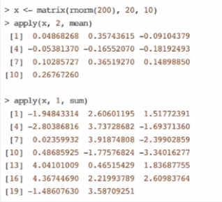
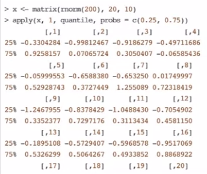

# Week 3

**Looping on the command line**:

Writing for, while loops is useful when programming but not particularly easy when working interactively on the command line. There are some functions which implement looping to make like easier.

- `lapply`: loop over a list and evaluate a function on each element.
- `sapply`: same as `lapply` but try to simplify the result.
- `apply`: apply a function over the margins of an array.
- `tapply`: apply a function over subsets of a vector.
- `mapply`: multivariate version of `lapply`.

An auxiliary function `split` is also useful, particularly in conjunction with `lapply`.

**`lapply`**:

Takes three arguments: (1) a list `x`; (2) a function (or the name of a function) `FUN`; (3) other arguments via its `...` argument. If `x` is not a list, it will be coerced to a list using `as.list`.

- The actual looping is done internally in C code.

Always returns a list, regardless of the class of the input.

~~~R
x <- list(a = 1:5, b = rnorm(10))
lapply(x, mean)
# $a
# [1] 3
#
# $b
# [1] 0.0296824

x <- 1:4
lapply(x, runif, min = 0, max = 10)
# [[1]]
# [1] 0.2675082
#
# [[2]]
# [1] 0.2186453  3.5167968
#
# [[3]]
# [1] 0.2689506  6.1811683  2.5185761
#
# [[4]]
# [1] 7.5627829  0.1291569  1.2563676  2.7179353
~~~

`lapply` and its *friends* make heavy use of <u>anonymous function</u>s.

An anonymous function for extracting the first column of each matrix.

~~~R
x <- list(a = matrix(1:4, 2, 2), b = matrix(1:6, 3, 2))
lapply(x, function(elt) elt[,1])
# $a
# [1] 1 2
#
# $b
# [1] 1 2 3
~~~

**`sapply`**:

Tries to simplify the result of `lapply if possible.`

- If the result is a list where every element is length 1, then a vector is returned.
- If the result is a list where every element is a vector of the same length (> 1), a matrix is returned.
- If it can't figure things out, a list is returned.

**`apply`**:

Is used to evaluate a function (often an anonymous one) over the margins of an array.

- It is most often used to apply a function to the rows or columns of a matrix.
- It can be used with general arrays, e. g., taking the average of an array of matrices.
- It is not really faster than writing a loop, but it works in one line.

~~~R
str(apply)
# function (X, MARGIN, FUN, ...)
~~~

- `X` is an array.
- `MARGIN` is an integer vector indicating which margins should be "retained".
- `FUN` is a function to be applied.
- `...` is for the other arguments to be passed to `FUN`.

###### col/row sums and means

For sums and means of matrix dimensions, we have some shortcuts.

- `rowSums` = `apply(x, 1, sum)`.
- `rowMeans` = `apply(x, 1, mean)`.
- `colSums` = `apply(x, 2, sum)`.
- `colMeans` = `apply(x, 2, mean)`.

The shortcut functions are *much* faster, but you will not notice unless you are using a large matrix.

###### Other ways to apply

Average matrix in an array.

~~~R
a <- array(rnorm(2*2*10), c(2,2,10))
apply(a, c(1,2), mean)
#            [1,]         [2,]
# [1,] -0.2353245  -0.03980211
# [2,] -0.3339748   0.04364908
rowMeans(a, dims = 2)
#            [1,]         [2,]
# [1,] -0.2353245  -0.03980211
# [2,] -0.3339748   0.04364908
~~~

**`mapply`**:

Is a multivariate apply of sorts which applies a function in parallel over a set of arguments.

~~~R
str(mapply)
# function (FUN, ..., MoreArgs = NULL, SIMPLIFY = TRUE,
#			USE.NAMES = TRUE)
~~~

- `FUN` is a function to apply.
- `...` contains arguments to apply over.
- `MoreArgs` is a list of other arguments to `FUN`.
- `SIMPLIFY` indicates whether the result should be simplified.

The following can be tedious to type: `list(rep(1,4), rep(2,3), rep(3,2), rep(4,1))`.

Instead we can do:

~~~R
mapply(rep, 1:4, 4:1)
# [[1]]
# [1] 1 1 1 1
#
# [[2]]
# [1] 2 2 2
#
# [[3]]
# [1] 3 3
#
# [[4]]
# [1] 4
~~~

###### Vectorizing a function

~~~R
noise <- function(n, mean, sd) {
    rnorm(n, mean, sd)
}
noise(5, 1, 2)
# [1] 2.4831198  2.4790100  0.4855190 -1.2117759
# [5] 3.7413584
noise(1:5, 1:5, 2)
# [1] 0.2861198  1.4750100 -1.4855190  5.2617759
# [5] 8.7473584
~~~

Instant vectorization.

which is the same as;

~~~R
list(noise(1,1,2), noise(2,2,2),
     noise(3,3,2), noise(4,4,2),
     noise(5,5,2))
~~~

**`tapply`**:

Is used to apply a function over subsets of a vector.

~~~R
str(tapply)
# function (X, INDEX, FUN = NULL, ..., simplify = TRUE)
~~~

- `X` is a vector.
- `INDEX` is a factor or a list of factors (or else they are coerced to factors).
- `FUN` is a function to be applied.
- `...` contains other arguments to be passed to `FUN`.
- `simplify`: should we simplify the result?

~~~R
x <- c(rnorm(10), runif(10), rnorm(10,1))
f <- gl(3,10)
f
#  [1] 1 1 1 1 1 1 1 1 1 1 2 2 2 2 2 2 2 2 2 2 3 3 3
# [24] 3 3 3 3 3 3 3
# Levels: 1 2 3
tapply(x, f, mean)
#         1         2         3
# 0.1144464 0.5163468 1.2463678
~~~

**`split`**:

Takes a vector or other objects and splits it into groups determined by a factor or list of factors.

~~~R
str(split)
# function (x, f, drop = FALSE, ...)
~~~

- `x` is a vector (or list) or data frame.
- `f` is a factor (or coerced to one) or a list of factors.
- `drop` indicates whether empty factors levels should be dropped.

A common idiom is `split` followed by an `lapply`:

~~~R
lapply(split(x, f), mean)
# $'1'
# [1] 0.1144464
#
# $'2'
# [1] 0.5163468
#
# $'3'
# [1] 1.246368
~~~

###### Splitting a data frame

~~~R
library(datasets)
head(airquality)
# ...
s <- split(airquality, airquality$Month)
lapply(s, function(x) colMeans(x[,c("Ozone","Solar.R","Wind")]))
# $'5'
#    Ozone  Solar.R     Wind
#       NA       NA 11.62258
# ...
~~~

~~~R
sapply(s, function(x) colMeans(x[,c("Ozone","Solar.R","Wind")],
                              na.rm = TRUE))
#56789
# Ozone      23.61538   29.44444   59.115385   59.961538   31.44828
# Solar.R   181.29630  190.16667  216.483871  171.857143  167.43333
# Wind       11.62258   10.26667    8.941935    8.793548   10.18000
~~~

###### Splitting on more than one level

~~~R
x <- rnorm(10)
f1 <- gl(2, 5)
f2 <- gl(5, 2)
f1
# [1] 1 1 1 1 1 2 2 2 2 2
# Levels: 1 2
f2
# [1] 1 1 2 2 3 3 4 4 5 5
# Levels: 1 2 3 4 5
interaction(f1, f2)
# [1] 1.1 1.1 1.2 1.2 1.3 2.3 2.4 2.4 2.5 2.5
# 10 Levels: ...
~~~

Interactions can create empty levels.

~~~R
str(split(x, list(f1, f2)))
# List of 10
#   $ 1.1: num [1:2] -0.378  0.445
#   $ 2.1: num(0)
#   $ 1.2: num [1:2] 1.4066 0.0166
#   $ 2.2: num(0)
# ...
~~~

- `drop = TRUE` will drop all levels with `num(0)`.

#### Debugging

Indications that something is not right:

- `message`: a generic notification/diagnostic message produced by the `message` function; execution of the function continues.
- `warning`: an indication that something is wrong but not necessarily fatal; execution of the function continues; generated by the `warning` function.
- `error`: an indication that a fatal problem has occurred; execution stops; produced by the `stop` function.
- `condition`: a generic concept for indicating that something unexpected can occur; programmers can create their own conditions.

**Debugging tools in R**:

- `traceback`: prints out the function call stack after an error occurs; does nothing if there is no error.
- `debug`: flags a function for "debug" mode which allows you to step through execution of a function one line at a time.
- `browser`: suspends the execution of a function wherever it is called and puts the function in debug mode.
- `trace`: allows you to insert debugging code into a function at specific places.
- `recover`: allows you to modify the error behavior so that you can browse the function call stack.

**`traceback`**:

~~~R
mean(x)
# Error in mean(x): object 'x' not found
traceback()
# 1: mean(x)
~~~

~~~R
lm(y ~ x)
# Error in lm(y ~ x): object 'y' not found
traceback()
# 7: eval(expr, envir, enclos)
# 6: eval(predvars, data, env)
# 5: model.frame.default(formula = y ~ x, drop.unused.levels = TRUE)
# 4: model.frame(formula = y ~ x, drop.unused.levels = TRUE)
# 3: eval(expr, envir, enclos)
# 2: eval(mf, parent.frame())
# 1: lm(y ~ x)
~~~

**`debug`**:

~~~R
debug(lm)
lm(y ~ x)
# debugging in: lm(y ~ x)
# debug: {
#	ret.x <- x
#	ret.y <- y
# 	cl <- match.all()
#	...
#	if (!qr)
#		z$qr <- NULL
#	z
# }
# Browse[2]>
~~~